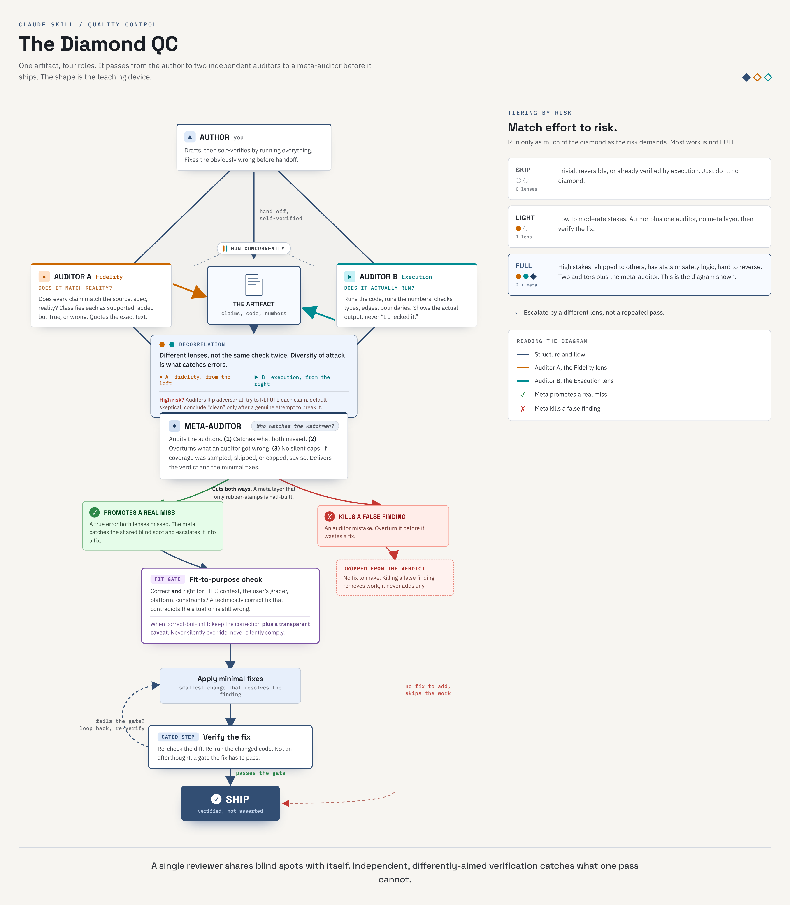

<p align="center"></p>

# Diamond QC

A small [Claude Code](https://claude.com/claude-code) skill for catching errors in
an artifact **before it ships** — study notes, code, prose, research, configs, data;
anything with claims you can actually check.

It's named for the shape: one **author** at the top, two independent **auditors**
across the middle, one **meta-auditor** at the bottom point. The bottom point is the
"who watches the watchmen" step.

## Why it's adversarial (and agentic)

A single reviewer — including the author — shares blind spots with itself. Re-reading
your own work mostly re-confirms it. Diamond QC fixes that by spreading the check
across several independent agents that are deliberately aimed at the artifact from
**different angles**:

- **Author** drafts, then verifies every claim it can *by execution* — runs the code,
  computes the numbers, traces each fact to a source. Known-shaky work is fixed here,
  not passed downstream.
- **Auditor A — fidelity.** Does every claim match the source/spec/reality? Hunts
  fabrications, distortions, and unsupported assertions, quoting exact text.
- **Auditor B — execution.** Runs the code, runs the numbers, checks types, shapes,
  boundaries, edge cases. "I checked it" is not allowed; it shows the run.
- **Meta-auditor — watches the watchmen.** Catches what *both* auditors missed (their
  shared blind spot) **and** overturns what an auditor got wrong (false positives),
  then delivers the final verdict and the minimal set of fixes.

The point is **decorrelation, not repetition**. Two auditors running the same check
share the same blind spot and waste a seat. Diversity of attack is what catches
errors. The skill verifies by **evidence, not assertion** — recall is not
verification — and escalates effort by *risk*, not by running the same pass twice.

It's also right-sized: a tiering rule (SKIP / LIGHT / FULL) keeps you from spinning
up five subagents to check a one-line fix.

<p align="center">
  <a href="./diamond-qc-diagram.pdf"></a>
</p>
<p align="center"><sub>The full protocol at a glance. Click for the printable PDF.</sub></p>

## What you need

- [Claude Code](https://docs.claude.com/en/docs/claude-code) installed.
- That's it — the skill is a single Markdown file. The auditors run as Claude Code
  subagents, so no extra dependencies, API keys, or services.

## Install

Clone (or copy) the skill into your Claude Code skills directory.

**User-level** (available in every project):

```bash
git clone https://github.com/DatJavaClass/diamond-qc.git ~/.claude/skills/diamond-qc
```

**Project-level** (this repo only):

```bash
git clone https://github.com/DatJavaClass/diamond-qc.git .claude/skills/diamond-qc
```

On Windows the user-level path is `%USERPROFILE%\.claude\skills\diamond-qc`.

> Claude Code discovers a skill by the `SKILL.md` at the root of its folder, so the
> folder must be named `diamond-qc` and contain `SKILL.md` directly.

## Use

Just ask Claude Code to run it, or name it directly:

- "**Diamond QC** this before I send it."
- "Run **the Diamond** on this analysis."
- "**Who watches the watchmen** — verify these numbers."
- Or any request to rigorously verify / fact-check / QC something before it ships.

Claude picks the tier (SKIP / LIGHT / FULL) based on stakes and tells you which it
chose. See [`SKILL.md`](./SKILL.md) for the full protocol.

## License

[MIT](./LICENSE) © DatJavaClass
